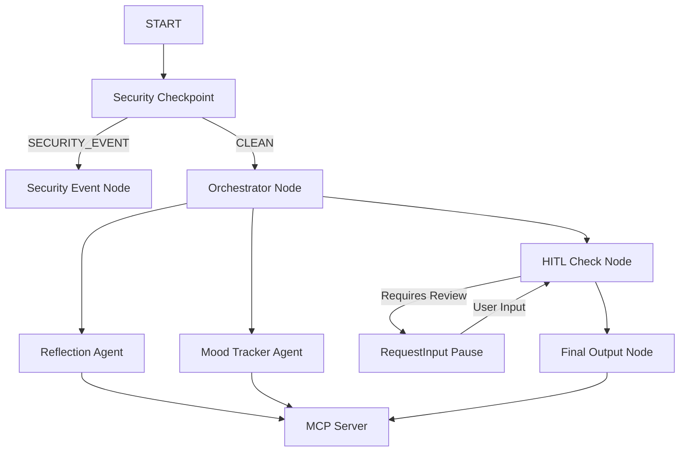

# Mindbridge — Submission Writeup

## Problem Statement
In a fast-paced world, individuals frequently experience emotional burnout, stress, and anxiety. Journaling is a proven cognitive-behavioral technique to process thoughts and regulate emotions. However, traditional journals are passive, failing to provide interactive cognitive insights. While AI-based tools can offer reflection, processing personal diaries online poses severe privacy risks. Mindbridge addresses this by offering a local-first, highly secure cognitive companion that tracks mood and extracts reflective insights without exposing user privacy.

---

## Solution Architecture

---

## Concepts Used & File References

1. **ADK 2.0 Workflow Graph:** Built programmatically in [agent.py](file:///c:/Users/HP/Documents/Kaggle_AI_Agents/mindbridge/app/agent.py#L182-L194) using `Workflow`, function nodes, and routing edges.
2. **LlmAgent & AgentTool:** Built specialized sub-agents [reflection_agent](file:///c:/Users/HP/Documents/Kaggle_AI_Agents/mindbridge/app/agent.py#L42-L47) and [mood_tracker_agent](file:///c:/Users/HP/Documents/Kaggle_AI_Agents/mindbridge/app/agent.py#L49-L54) wrapped in `AgentTool` inside the [orchestrator_agent](file:///c:/Users/HP/Documents/Kaggle_AI_Agents/mindbridge/app/agent.py#L57-L62).
3. **Model Context Protocol (MCP):** Configured a local stdio MCP server in [mcp_server.py](file:///c:/Users/HP/Documents/Kaggle_AI_Agents/mindbridge/app/mcp_server.py) and integrated it via `McpToolset` into the sub-agents.
4. **Security Checkpoint:** Implemented local PII scrubbing, keyword-based prompt injection detection, and structured JSON audit logging in [agent.py](file:///c:/Users/HP/Documents/Kaggle_AI_Agents/mindbridge/app/agent.py#L90-L121).
5. **Agents CLI:** Scaffolding, dependency isolation, and interactive testing handled seamlessly via the CLI tool.

---

## Security Design

Privacy is Mindbridge's core value:
- **PII Scrubbing:** Replaces emails and phone numbers with generic labels (`[EMAIL_REDACTED]`, `[PHONE_REDACTED]`) locally before sending text to the Gemini API.
- **Prompt Injection Detection:** Screens inputs against malicious instruction keywords (e.g., "ignore previous instructions") and terminates processing via the `SECURITY_EVENT` route.
- **Audit Logging:** Automatically records every operation and security outcome to a local `audit.log` file in JSON format for transparency.
- **Opt-Out Consent Check:** Inspects inputs for consent preferences; if a user requests not to store data, storage is skipped.

---

## MCP Server Design

Exposes 3 specialized local tools:
1. `save_journal_entry`: Saves the scrubbed content, mood score, and themes list to a local secure JSON database.
2. `get_mood_history`: Extracts historical mood ratings to plot longitudinal trends.
3. `get_recent_reflections`: Pulls up to 5 recent reflections to identify recurring cognitive patterns.

---

## Human-in-the-Loop (HITL) Flow

A vital safety feature of Mindbridge is the **HITL Review**.
When the sub-agent computes an extreme mood score (low mood <= 3 indicating high distress, or high mood >= 9 indicating extreme mania/excitement), the `hitl_check_node` halts workflow execution and yields a `RequestInput` card.
This forces a manual verification check where the user must review and approve the draft reflection before it is written to the local database, providing a conscious pause.

---

## Demo Walkthrough

1. **Standard Run (Auto-Approve):** When a user records a balanced reflection, the system extracts key themes, rates mood (e.g. 7/10), auto-approves, and saves.
2. **Extreme Mood (HITL):** A distressed diary entry flags a mood score of 2/10. The UI pauses, showing a review prompt. The user types "yes" to approve, saving the journal.
3. **Prompt Injection (Blocked):** Malicious inputs targeting system rules are caught by the security checkpoint and routed directly to the alert page, preventing injection.

---

## Impact & Value Statement

Mindbridge bridges the gap between active mental wellness and privacy. By executing security scrubbing and database logic locally, and using advanced LLMs solely for reflection and mood analysis, it empowers individuals to safely document their mental states. Users gain personal insights, and can track their emotional wellbeing over time without ever risking their personal data.
